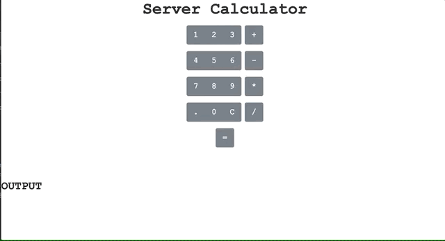

# Server Side Calculator

Welcome to the second weekend challenge!

This is a server side calculator. 

## SETUP
download this repo. npm start in terminal and navigate to the PORT it's listening on. 

## DESCRIPTION
 This application demonstrates server side calculation. 
 A user interface where the user can input two values (2 input elements) and the select type of mathematical operation. When the submit, `=` button is clicked, this is captured, bundled  and then sent to the server. 

 The user inputs is collected and sent to the server for the calculation to be made on the server and the result send back the the user.
The user input is displayed to the user in the OUTPUT and the result also.
A history of the calculation made is displayed in an unordered list below.
The  'C' button  clears the user input fields.

## TECHNOLOGY USED
- JavaScript
- jQuery - selectors, append and event handling
- Bootstrap
- CSS
- HTML
- Express - server 

## APP DEMO

